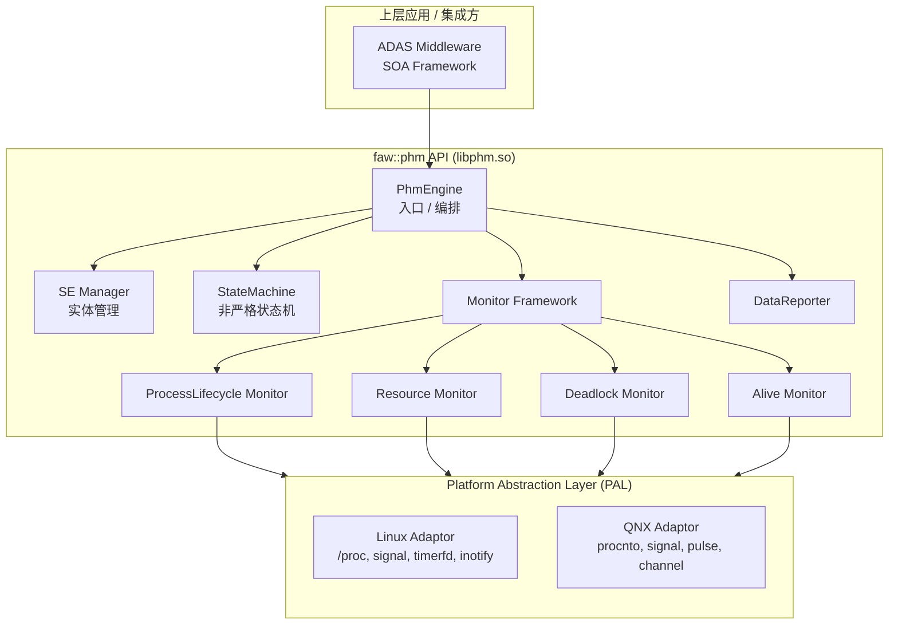
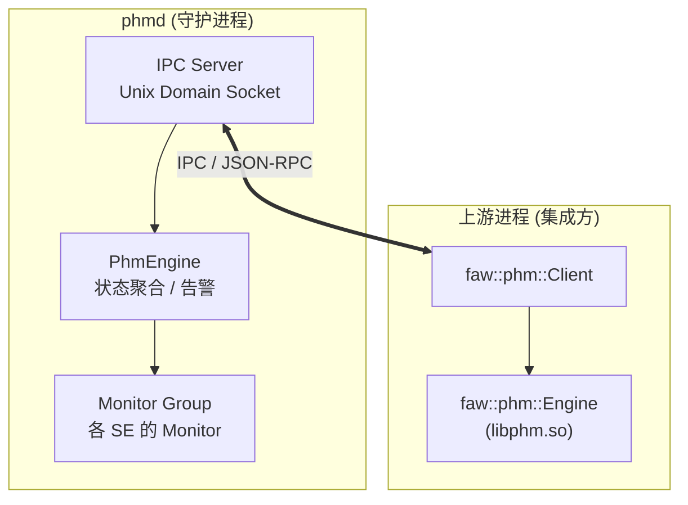
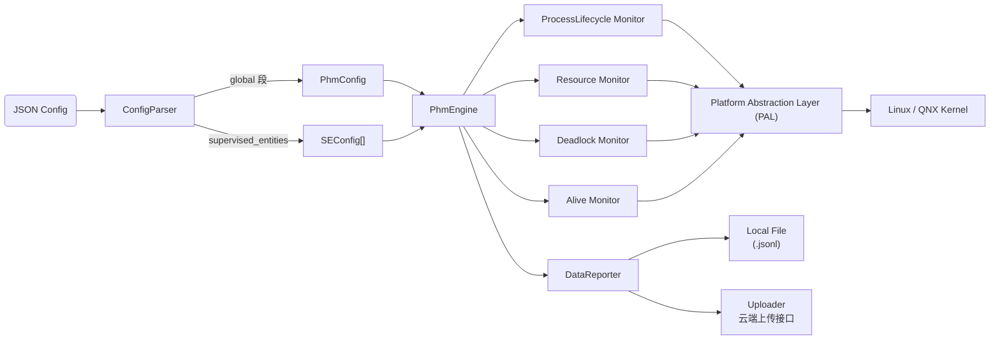
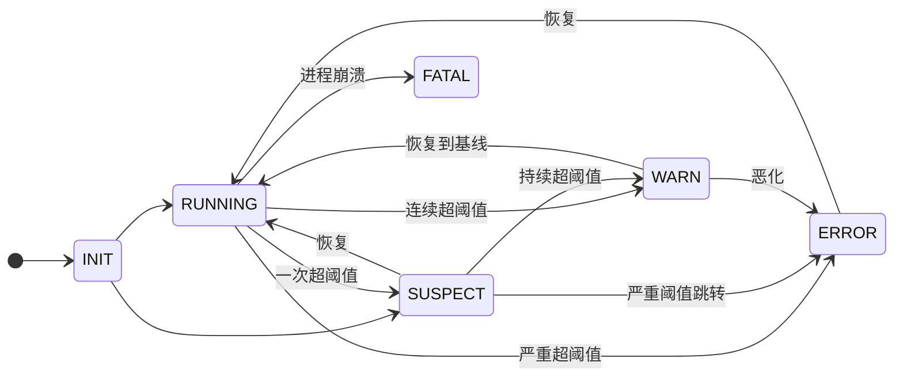
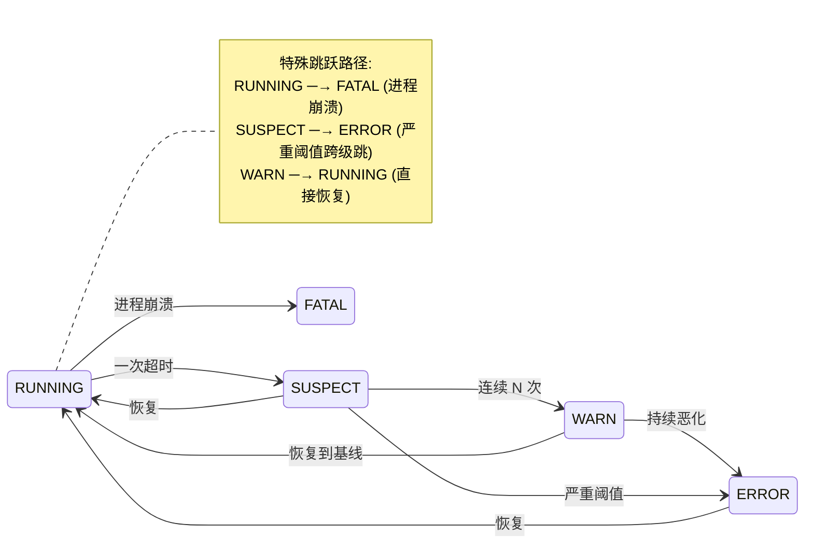
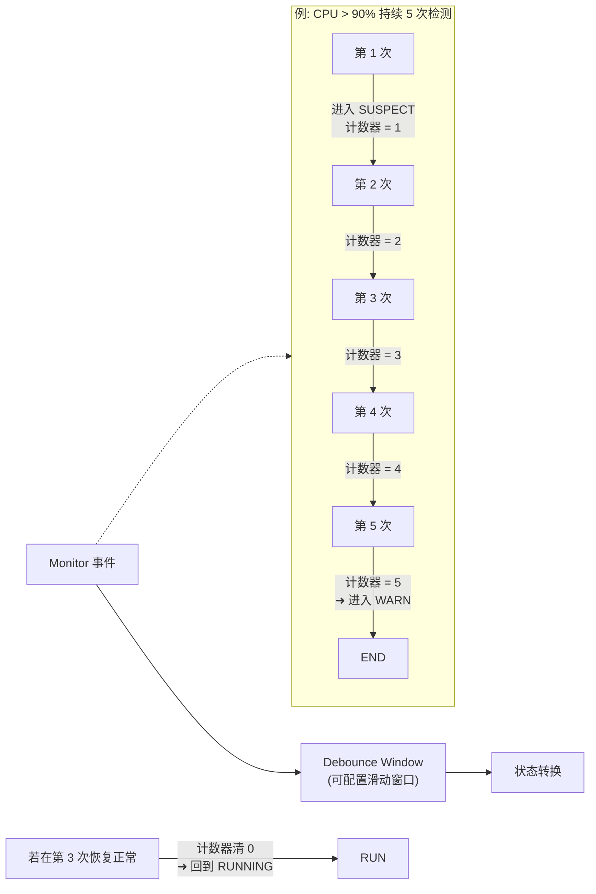
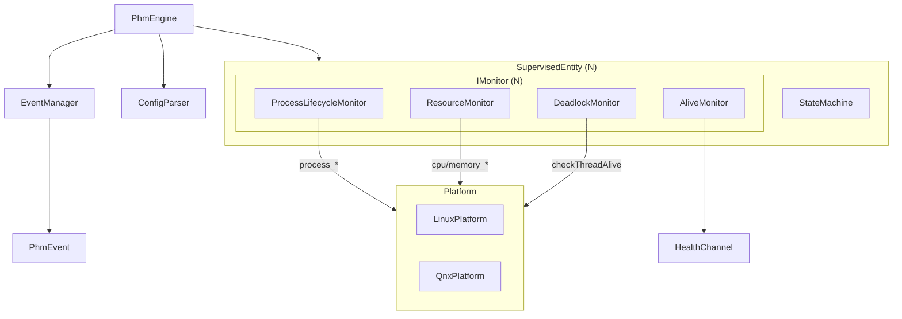

# PHM (Platform Health Management) 架构规范文档

## 1. 概述

### 1.1 项目定位

PHM（Platform Health Management）是智能驾驶系统中的平台健康管理模块，负责监控系统内各监督实体（Supervised Entity, SE）的运行状态，包括进程生命周期、CPU/内存资源、死锁/挂死检测等。PHM 提供统一的 C++ API 库（libphm.so）和守护进程（phmd），供上层应用集成。

### 1.2 设计原则

- **轻量化**：最小资源占用，不引入额外依赖链；核心库仅依赖 C++17 标准库 + POSIX API + nlohmann/json 单头文件
- **可扩展**：Monitor 插件化设计，新增监控类型无需修改框架代码
- **跨平台**：通过 PAL（Platform Abstraction Layer）抽象层同时适配 Linux 和 QNX
- **健壮性**：非严格状态机设计，容忍告警抖动，支持自动恢复
- **配置驱动**：SE 配置通过 JSON 描述，支持运行时重载

### 1.3 核心约束

| 约束项    | 说明                                              |
| ------ | ----------------------------------------------- |
| 语言标准   | C++17                                           |
| 编译工具   | CMake 3.16+                                     |
| 目标平台   | Linux (x86\_64/aarch64), QNX 7.1+               |
| 外部依赖   | C++17 标准库 + libpthread + nlohmann/json (单头文件) |
| 输出产物   | libphm.so, libphm.a, phmd 可执行文件                   |
| 命名空间   | `faw::phm`                                      |
| 运行时内存  | < 5MB (稳态)                                      |
| CPU 占用 | < 1% (100ms 检测周期)                               |

***

## 2. 整体架构

### 2.1 架构分层



### 2.2 进程架构



### 2.3 核心数据流



***

## 3. 模块划分

### 3.1 libphm.so 核心库模块

| 模块                    | 目录                          | 职责                                |
| --------------------- | --------------------------- | --------------------------------- |
| **PhmEngine**         | `src/phm_engine.cpp`        | 核心入口，生命周期管理，SE 注册/注销，全局状态聚合       |
| **SE Manager**        | `src/se_manager.cpp`        | Supervised Entity 管理，依赖关系解析，状态机编排 |
| **StateMachine**      | `src/state_machine.cpp`     | 非严格状态机实现，状态转换逻辑，抖动抑制              |
| **Monitor Framework** | `src/monitor_framework.cpp` | Monitor 注册/调度，检测周期控制，结果回调         |
| **ConfigParser**      | `src/config_parser.cpp`     | SE 配置 JSON 解析，Schema 校验            |
| **EventManager**      | `src/event_manager.cpp`     | 事件队列，告警分级，通知分发                    |
| **PAL**               | `src/platform/pal.cpp`      | 平台抽象接口定义和工厂方法                     |
| **DataReporter**      | `src/data_reporter.cpp`     | Monitor 采样数据本地落盘 + 云端上传框架         |

#### 3.1.1 Monitor 插件

| Monitor                 | 文件                                           | 功能                                |
| ----------------------- | -------------------------------------------- | --------------------------------- |
| ProcessLifecycleMonitor | `src/monitors/process_lifecycle_monitor.cpp` | 进程启动/停止/重启检测，进程存活轮询               |
| ResourceMonitor         | `src/monitors/resource_monitor.cpp`          | CPU 使用率、内存占用、FD 数量监控              |
| DeadlockMonitor         | `src/monitors/deadlock_monitor.cpp`          | 通过 HealthChannel 定时写入和检查实现挂死/死锁检测 |
| AliveMonitor            | `src/monitors/alive_monitor.cpp`             | 心跳检测，AliveCounter 递增校验            |

### 3.2 phmd 守护进程模块

| 模块               | 文件                                     | 职责                           |
| ---------------- | -------------------------------------- | ---------------------------- |
| Daemon           | `daemon/main.cpp`, `daemon/daemon.cpp` | 守护进程化，信号处理，配置加载              |
| IPC Server       | `daemon/ipc_server.cpp`                | Unix Domain Socket 服务，状态查询接口 |
| Alert Aggregator | `daemon/alert_aggregator.cpp`          | 多 SE 告警汇总，去重，降噪              |

### 3.3 平台抽象层 (PAL)

| 适配器           | 文件                                      | 实现方式                                            |
| ------------- | --------------------------------------- | ----------------------------------------------- |
| LinuxProcess  | `src/platform/linux/process_linux.cpp`  | `/proc/[pid]/stat`, `kill()`, `fork()/exec()`   |
| LinuxResource | `src/platform/linux/resource_linux.cpp` | `/proc/[pid]/status`, `/proc/stat`, `sysinfo()` |
| LinuxDeadlock | `src/platform/linux/deadlock_linux.cpp` | `timerfd` + `pthread_timedjoin`                 |
| QNXProcess    | `src/platform/qnx/process_qnx.cpp`      | `procnto`-based, `slm_*`, `SignalWaitinfo`      |
| QNXResource   | `src/platform/qnx/resource_qnx.cpp`     | `procnto` `devctl()`, `asinfo()`                |
| QNXDeadlock   | `src/platform/qnx/deadlock_qnx.cpp`     | `pulse` + `channel`, `SyncCondTimedwait`        |

***

## 4. 非严格状态机设计

### 4.1 状态定义



**状态说明**:

| 状态        | 标签 | 含义                  | 动作                     |
| --------- | -- | ------------------- | ---------------------- |
| `INIT`    | 初始 | SE 刚注册，Monitor 尚未启动 | 加载配置，注册回调              |
| `RUNNING` | 健康 | 所有 Monitor 检测指标正常   | 正常轮询                   |
| `SUSPECT` | 可疑 | 单次检测超阈值但未持续确认       | 增加检测频率，抖动窗口抑制          |
| `WARN`    | 警告 | 持续超阈值，但可恢复          | 上报告警，触发自动恢复尝试          |
| `ERROR`   | 错误 | 严重超阈值，功能可能受影响       | 升级告警，通知上游              |
| `FATAL`   | 致命 | 进程已死/不可恢复           | 触发自恢复逻辑(restart/panic) |

### 4.2 非严格特性

非严格状态机允许跳跃转换，不要求严格按层级升降：



### 4.3 抖动抑制（Debounce）



***

## 5. 接口设计

### 5.1 核心 API (faw::phm)

#### 5.1.1 枚举和类型

```cpp
namespace faw::phm {

/// 监督实体状态（非严格状态机）
enum class SeState : uint8_t {
    INIT    = 0,
    RUNNING = 1,
    SUSPECT = 2,
    WARN    = 3,
    ERROR   = 4,
    FATAL   = 5
};

/// 告警严重级别
enum class Severity : uint8_t {
    INFO     = 0,
    WARNING  = 1,
    ERROR    = 2,
    CRITICAL = 3,
    FATAL    = 4
};

/// 监控类型
enum class MonitorType : uint8_t {
    PROCESS_LIFECYCLE = 0,
    RESOURCE          = 1,
    DEADLOCK          = 2,
    ALIVE             = 3,
    CUSTOM            = 4
};

/// 健康通道状态
struct HealthChannelStatus {
    uint64_t            alive_counter{0};
    bool                is_alive{false};
    std::chrono::steady_clock::time_point last_check;
};

/// PHM 事件
struct PhmEvent {
    std::string                         id;
    std::string                         source_se;
    std::string                         source_monitor;
    Severity                            severity{Severity::INFO};
    SeState                             state{SeState::INIT};
    std::string                         message;
    std::chrono::system_clock::time_point timestamp;
    std::map<std::string, std::string>  metadata;
};

/// 监控配置
struct MonitorConfig {
    MonitorType                         type{MonitorType::CUSTOM};
    std::map<std::string, std::string>  params;     // 监控特有参数
    std::chrono::milliseconds           interval{1000ms};   // 检测周期
    std::chrono::milliseconds           timeout{5000ms};    // 检测超时
    uint32_t                            debounce_count{3};  // 抖动窗口连续次数
    double                              warn_threshold{0.0};
    double                              error_threshold{0.0};
    bool                                enabled{true};
};

/// SE 配置
struct SEConfig {
    std::string                         name;
    std::string                         description;
    std::vector<MonitorConfig>          monitors;
    std::vector<std::string>            dependencies;   // 依赖的 SE 名称列表
    std::chrono::milliseconds           alive_timeout{5000ms};
    bool                                auto_restart{false};
    uint32_t                            max_restart_count{3};
    std::chrono::seconds                restart_delay{5s};
    bool                                enabled{true};
};

/// 全局 PHM 配置
struct PhmConfig {
    std::string                         app_name{"phmd"};
    std::string                         version{"1.0.0"};
    std::chrono::milliseconds           tick_interval{100ms};
    std::string                         log_dir{"/var/log/phmd"};
    std::string                         ipc_endpoint{"/tmp/phmd.sock"};
    std::string                         config_path{"/etc/phm/se_config.json"};
    bool                                enable_auto_recovery{true};
    uint32_t                            event_queue_size{1024};
};

} // namespace faw::phm
```

#### 5.1.2 接口类

```cpp
namespace faw::phm {

// ===== HealthChannel =====
/// 健康通道：被监督进程通过此接口上报活性和状态
class HealthChannel {
public:
    explicit HealthChannel(std::string name);
    ~HealthChannel();

    // 禁用拷贝
    HealthChannel(const HealthChannel&) = delete;
    HealthChannel& operator=(const HealthChannel&) = delete;

    // 允许移动
    HealthChannel(HealthChannel&&) noexcept;
    HealthChannel& operator=(HealthChannel&&) noexcept;

    /// 被监督进程调用：上报 Alive 计数器递增
    bool report(uint64_t alive_counter);

    /// 被监督进程调用：上报自定义状态数据
    bool reportStatus(const std::string& key, const std::string& value);

    /// PHM 侧调用：获取最新 Alive 计数
    uint64_t getAliveCounter() const;

    /// PHM 侧调用：检查是否为活跃状态
    bool isAlive() const;

    /// 获取通道名称
    const std::string& name() const noexcept { return name_; }

private:
    class Impl;
    std::unique_ptr<Impl> impl_;
};

// ===== IMonitor =====
/// Monitor 抽象接口 —— 所有具体 Monitor 需实现此接口
class IMonitor {
public:
    virtual ~IMonitor() = default;

    /// 启动监控
    virtual bool start() = 0;

    /// 停止监控
    virtual void stop() = 0;

    /// 执行一次检测（同步）
    virtual PhmEvent check() = 0;

    /// 获取当前状态
    virtual SeState getState() const = 0;

    /// 获取监控类型
    virtual MonitorType getType() const noexcept = 0;

    /// 配置
    virtual void configure(const MonitorConfig& cfg) = 0;

    /// 获取监控名称
    virtual const std::string& name() const noexcept = 0;

    // 事件回调
    using EventCallback = std::function<void(const PhmEvent&)>;
    virtual void setEventCallback(EventCallback cb) = 0;
};

// ===== SupervisedEntity =====
/// 监督实体：管理一组 Monitor，维护实体级状态机
class SupervisedEntity {
public:
    explicit SupervisedEntity(SEConfig config);
    ~SupervisedEntity();

    SupervisedEntity(const SupervisedEntity&) = delete;
    SupervisedEntity& operator=(const SupervisedEntity&) = delete;
    SupervisedEntity(SupervisedEntity&&) noexcept;
    SupervisedEntity& operator=(SupervisedEntity&&) noexcept;

    /// 注册 Monitor
    bool registerMonitor(std::unique_ptr<IMonitor> monitor);

    /// 启动所有 Monitor
    bool start();
    /// 停止所有 Monitor
    void stop();

    /// 获取当前实体状态
    SeState getState() const;

    /// 获取实体名称
    const std::string& name() const noexcept { return config_.name; }

    /// 获取待处理事件列表
    std::vector<PhmEvent> drainEvents();

    /// 获取健康通道引用
    HealthChannel* getHealthChannel() noexcept;

    /// 获取配置
    const SEConfig& config() const noexcept { return config_; }

    // 状态变更回调
    using StateChangeCallback = std::function<void(
        const std::string& se_name,
        SeState old_state,
        SeState new_state)>;
    void setStateChangeCallback(StateChangeCallback cb);

    /// 重置实体（回到 INIT 状态）
    void reset();

private:
    class Impl;
    std::unique_ptr<Impl> impl_;
};

// ===== PhmEngine =====
/// PHM 引擎：全局入口，管理所有 SE，聚合全局状态
class PhmEngine {
public:
    explicit PhmEngine(PhmConfig config = PhmConfig{});
    ~PhmEngine();

    PhmEngine(const PhmEngine&) = delete;
    PhmEngine& operator=(const PhmEngine&) = delete;

    /// 加载 JSON 配置文件（同时解析 global 段并应用为引擎配置）
    bool loadConfiguration(const std::string& json_path);

    /// 直接添加 SE 配置
    bool addSupervisedEntity(SEConfig cfg);

    /// 注册已构建的 SE 对象
    bool registerEntity(std::shared_ptr<SupervisedEntity> entity);

    /// 移除 SE
    bool removeEntity(const std::string& name);

    /// 启动引擎
    bool start();

    /// 停止引擎
    void stop();

    /// 引擎是否运行中
    bool isRunning() const noexcept;

    /// 获取全局聚合状态（取最严重 SE 的状态）
    SeState getGlobalState() const;

    /// 获取所有 SE 的待处理事件（按严重级别过滤）
    std::vector<PhmEvent> getAllEvents(Severity min_severity = Severity::INFO);

    /// 清除已处理事件
    void acknowledgeEvents(const std::vector<std::string>& event_ids);

    /// 获取 SE 对象
    std::shared_ptr<SupervisedEntity> getEntity(const std::string& name) const;

    /// 获取所有 SE 名称
    std::vector<std::string> getEntityNames() const;

    /// 获取引擎统计信息
    struct EngineStats {
        size_t      total_entities{0};
        size_t      active_entities{0};
        size_t      total_monitors{0};
        size_t      pending_events{0};
        SeState     global_state{SeState::INIT};
        uint64_t    uptime_ms{0};
    };
    EngineStats getStats() const;

    /// 运行时重载配置
    bool reloadConfiguration();

    /// 全局状态变更回调
    using GlobalStateCallback = std::function<void(SeState old_state, SeState new_state)>;
    void setGlobalStateCallback(GlobalStateCallback cb);

private:
    class Impl;
    std::unique_ptr<Impl> impl_;
};

// ===== Platform Factory =====
/// 平台抽象层工厂
class Platform {
public:
    virtual ~Platform() = default;

    // --- 进程管理 ---
    virtual bool        processExists(pid_t pid) = 0;
    virtual pid_t       getProcessId(const std::string& process_name) = 0;
    virtual bool        startProcess(const std::string& path,
                                     const std::vector<std::string>& args) = 0;
    virtual bool        stopProcess(pid_t pid, int sig = 15) = 0;
    virtual bool        waitProcess(pid_t pid,
                                    std::chrono::milliseconds timeout) = 0;

    // --- 资源监控 ---
    virtual double      getCpuUsage(pid_t pid) = 0;
    virtual uint64_t    getMemoryUsageBytes(pid_t pid) = 0;
    virtual uint64_t    getTotalSystemMemory() = 0;
    virtual uint32_t    getOpenFileCount(pid_t pid) = 0;
    virtual double      getSystemCpuLoad() = 0;

    // --- 系统信息 ---
    virtual std::string getHostname() = 0;
    virtual uint64_t    getSystemUptimeMs() = 0;

    // --- 死锁/挂死检测 ---
    virtual bool        checkThreadAlive(pthread_t thread,
                                         std::chrono::milliseconds timeout) = 0;

    /// 工厂方法：根据运行平台创建具体实现
    static std::unique_ptr<Platform> create();
};

// ===== Logger (轻量) =====
/// PHM 内部日志接口
class Logger {
public:
    enum Level : uint8_t { DEBUG = 0, INFO = 1, WARN = 2, ERROR = 3 };

    static Logger& instance();
    void setLevel(Level lv);
    bool setOutput(const std::string& path);

    void log(Level lv, const char* file, int line, const char* func,
             const char* fmt, ...);

    // 便捷宏
    // PHM_LOG_DEBUG(fmt, ...)
    // PHM_LOG_INFO(fmt, ...)
    // PHM_LOG_WARN(fmt, ...)
    // PHM_LOG_ERROR(fmt, ...)

private:
    Logger() = default;
    ~Logger() = default;
};

// ===== ParseResult =====
/// 配置解析结果（parseFile / parseString 的返回值）
struct ParseResult {
    PhmConfig                   global;     ///< 全局配置（来自 JSON global 段）
    std::vector<SEConfig>       entities;   ///< SE 配置列表（来自 JSON supervised_entities 段）
};

// ===== ConfigParser =====
/// SE 配置文件解析器（JSON 格式）
class ConfigParser {
public:
    /// 解析 JSON 配置文件，返回 ParseResult
    static ParseResult parseFile(const std::string& json_path);

    /// 从 JSON 字符串解析
    static ParseResult parseString(const std::string& json_content);

    /// 验证 JSON 是否符合 Schema
    static bool validate(const std::string& json_path);

    /// 获取最后错误信息
    static std::string lastError();

    /// 将 MonitorType 转为字符串
    static std::string monitorTypeToString(MonitorType type);
};

// ===== DataRecord =====
/// 一条监控采样数据记录
struct DataRecord {
    std::string                         se_name;
    std::string                         monitor_name;
    std::string                         monitor_type;
    SeState                             state{SeState::INIT};
    int64_t                             timestamp_ms{0};
    std::map<std::string, double>       metrics;
    std::string                         raw_data;
};

// ===== Uploader =====
/// 云端上传器抽象接口（框架，待实现完整上传逻辑）
class Uploader {
public:
    virtual ~Uploader() = default;
    virtual bool initialize(const std::string& config) = 0;
    virtual bool upload(const DataRecord& record) = 0;
    virtual bool uploadBatch(const std::vector<DataRecord>& records) = 0;
    virtual bool isAvailable() const noexcept = 0;
    virtual const std::string& name() const noexcept = 0;
};

// ===== DataReporter =====
/// 数据上报器：本地 JSON Lines 落盘 + Uploader 回调
class DataReporter {
public:
    explicit DataReporter(const std::string& data_dir = "/var/log/phmd/data");
    ~DataReporter();

    void report(const DataRecord& record);
    void reportBatch(const std::vector<DataRecord>& records);
    void setUploader(std::unique_ptr<Uploader> uploader);
};

} // namespace faw::phm
```

### 5.2 phmd IPC 接口

Unix Domain Socket 协议（JSON over UDS）：

```json
// 请求：查询全局状态
{
    "method": "get_global_state",
    "id": 1
}

// 响应
{
    "jsonrpc": "2.0",
    "id": 1,
    "result": {
        "global_state": "RUNNING",
        "uptime_ms": 3600000
    }
}

// 请求：查询特定 SE
{
    "method": "get_entity",
    "params": {"name": "adas_camera"},
    "id": 2
}

// 请求：列出所有事件
{
    "method": "list_events",
    "params": {"min_severity": "WARNING"},
    "id": 3
}

// 通知：配置重载
{
    "method": "reload_config",
    "id": 4
}
```

***

## 6. SE 配置 JSON 格式

### 6.1 JSON Schema

参见 `schemas/se_config.schema.json`。`global` 段支持映射 `PhmConfig` 的所有字段，例：

```json
{
    "global": {
        "tick_interval_ms": 100,
        "log_dir": "/var/log/phmd",
        "enable_auto_recovery": true,
        "event_queue_size": 1024,
        "app_name": "phmd",
        "version": "1.0.0",
        "ipc_endpoint": "/tmp/phmd.sock",
        "config_path": "/etc/phm/se_config.json"
    },
    "supervised_entities": [
        {
            "name": "adas_perception",
            "description": "ADAS 感知模块",
            "alive_timeout_ms": 5000,
            "auto_restart": true,
            "max_restart_count": 3,
            "restart_delay_s": 5,
            "dependencies": ["camera_driver"],
            "monitors": [
                {
                    "type": "process_lifecycle",
                    "enabled": true,
                    "interval_ms": 1000,
                    "params": {
                        "process_name": "adas_perception",
                        "process_path": "/opt/faw/bin/adas_perception"
                    }
                },
                {
                    "type": "resource",
                    "enabled": true,
                    "interval_ms": 2000,
                    "warn_threshold_cpu": 80.0,
                    "error_threshold_cpu": 95.0,
                    "debounce_count": 3
                },
                {
                    "type": "alive",
                    "enabled": true,
                    "interval_ms": 1000,
                    "timeout_ms": 5000
                },
                {
                    "type": "deadlock",
                    "enabled": true,
                    "interval_ms": 5000,
                    "timeout_ms": 2000
                }
            ]
        },
        {
            "name": "camera_driver",
            "description": "摄像头驱动",
            "alive_timeout_ms": 3000,
            "auto_restart": true,
            "max_restart_count": 5,
            "monitors": [
                {
                    "type": "process_lifecycle",
                    "enabled": true,
                    "interval_ms": 500,
                    "params": {
                        "process_name": "camera_driver"
                    }
                },
                {
                    "type": "deadlock",
                    "enabled": true,
                    "interval_ms": 3000
                }
            ]
        }
    ]
}
```

***

## 7. 构建方案

### 7.1 构建脚本

推荐使用项目根目录的 `build.sh` 脚本：

```bash
# Linux release 构建
./build.sh -p linux

# Linux debug 构建, 启用测试, 安装到 output/
./build.sh -p linux -t debug -T -i

# QNX 交叉编译（使用 cmake/qnx-aarch64.cmake）
./build.sh -p qnx
```

### 7.2 CMake 结构

```
build.sh                            # 便捷构建脚本
CMakeLists.txt                      # 顶层
├── src/CMakeLists.txt              # libphm.so / libphm.a
├── daemon/CMakeLists.txt           # phmd 可执行文件
├── tests/CMakeLists.txt            # 单元测试
└── examples/CMakeLists.txt         # 示例
```

详见 `build.sh` 帮助（`./build.sh -h`）。

### 7.3 CMake 构建选项

| 选项                   | 类型     | 默认值  | 说明                    |
| -------------------- | ------ | ---- | --------------------- |
| `PHM_BUILD_DAEMON`   | BOOL   | ON   | 构建 phmd 守护进程          |
| `PHM_BUILD_TESTS`    | BOOL   | OFF  | 构建单元测试                |
| `PHM_BUILD_EXAMPLES` | BOOL   | OFF  | 构建示例程序                |
| `PHM_PLATFORM`       | STRING | linux | 目标平台(linux/qnx)       |

### 7.4 产物

```
build/
├── src/libphm.so              # 共享库
├── src/libphm.a               # 静态库
├── daemon/phmd                # 守护进程
├── tests/phm_test_*           # 测试（若启用）
└── examples/phm_example_basic # 示例（若启用）

# 执行 -i 安装后：
output/
├── lib/libphm.so*
├── lib/libphm.a
├── bin/phmd
├── include/faw/phm/*.h
└── etc/phm/phm_se_config.json
```

***

## 8. 轻量化设计要点

### 8.1 资源控制策略

- **无额外线程池**：每个 Monitor 使用 timerfd（Linux）或 pulse（QNX）异步触发，不创建独立线程
- **事件队列有界**：固定大小环形缓冲区（默认 1024），超出丢弃最旧事件
- **零拷贝事件传递**：Monitor 内联生成 `PhmEvent` 后通过 callback 直接分发
- **按需轮询**：RUNNING 状态的 SE 降低检测频率，WARN/ERROR 状态加速检测

### 8.2 内存预算

| 组件                   | 预估内存         |
| -------------------- | ------------ |
| PhmEngine 核心         | \~64 KB      |
| 每个 SE（含 4 个 Monitor） | \~16 KB      |
| 事件队列（1024 条）         | \~128 KB     |
| 日志缓冲区                | \~64 KB      |
| **总计（10 个 SE）**      | **\~1.5 MB** |

### 8.3 CPU 预算

| 操作                     | 预估耗时                            |
| ---------------------- | ------------------------------- |
| 一次 `process_exists` 调用 | \~10 us (Linux) / \~50 us (QNX) |
| 一次 `getCpuUsage`       | \~50 us (读取 /proc)              |
| 一次 `checkAlive`        | \~5 us                          |
| 状态机转换                  | < 1 us                          |
| 100ms 周期内 10 个 SE 全检   | < 500 us (< 0.5% CPU)           |

***

## 9. 跨平台适配要点

### 9.1 平台差异对照

| 功能      | Linux                        | QNX                               |
| ------- | ---------------------------- | --------------------------------- |
| 进程列表    | `/proc/[pid]/stat`           | `procnto` devctl + `slm_query`    |
| CPU 使用率 | `/proc/stat` + 进程 jiffies    | `procfs_rusage`                   |
| 内存使用    | `/proc/[pid]/status VmRSS`   | `asinfo()` + `devctl()`           |
| 进程创建    | `fork()` + `exec()`          | `spawn()` / `slm_start_process()` |
| 信号/终止   | `kill(pid, SIGTERM/SIGKILL)` | `SignalKill()`                    |
| 定时器     | `timerfd_create`             | `pulse` + `timer_create`          |
| 线程可用性   | `pthread_timedjoin_np`       | `SyncCondTimedwait` + 自定义 pulse   |
| IPC     | Unix Domain Socket           | `channel` + `pulse` / Unix Socket |
| 文件描述符数  | `/proc/[pid]/fd/` count      | `devctl(fd, DCMD_PROC_INFO, ...)` |

### 9.2 条件编译

```cpp
#if defined(__linux__)
    #define PHM_PLATFORM_LINUX 1
#elif defined(__QNX__) || defined(__QNXNTO__)
    #define PHM_PLATFORM_QNX 1
#else
    #error "Unsupported platform"
#endif
```

***

## 10. 测试策略

### 10.1 单元测试层级

| 层级 | 覆盖内容                                     | 框架                   |
| -- | ---------------------------------------- | -------------------- |
| L0 | StateMachine, ConfigParser, EventManager | Google Test          |
| L1 | Monitor 基础逻辑（模拟 PAL）                     | Google Test + Mock   |
| L2 | PAL 平台适配（在真实宿主机上）                        | Google Test          |
| L3 | phmd IPC 协议测试                            | Google Test + Socket |
| L4 | 集成测试（多 SE 场景）                            | 脚本 + 测试程序            |

### 10.2 关键测试用例

- StateMachine: 正常状态转换、跳跃转换、抖动抑制、非法转换
- Monitor: 进程消失检测、CPU 阈值触发、死锁检测超时
- ConfigParser: 合法 JSON、非法 JSON、缺失字段、特殊字符
- PAL: Linux 和 QNX 各 API 的单向测试
- IPC: JSON-RPC 请求/响应、超时、并发客户端

***

## 11. 目录结构

```
phm/
├── build.sh                         # 便捷构建脚本
├── CMakeLists.txt                   # 顶层构建文件
├── config/
│   └── phm_se_config.json           # 默认 SE 配置样例
├── schemas/
│   └── se_config.schema.json        # 配置 JSON Schema
├── cmake/
│   └── qnx-aarch64.cmake            # QNX 交叉编译 toolchain
├── third_party/
│   └── nlohmann/
│       └── json.hpp                 # nlohmann/json 单头文件
├── include/
│   └── faw/
│       └── phm/
│           ├── phm.h               # 统一包含头文件
│           ├── types.h             # 枚举和结构体定义
│           ├── health_channel.h    # 健康通道
│           ├── monitor.h           # IMonitor 抽象接口
│           ├── supervised_entity.h # SupervisedEntity
│           ├── phm_engine.h        # PhmEngine
│           ├── platform.h          # Platform 抽象层
│           ├── config_parser.h     # 配置解析器
│           ├── data_reporter.h     # 数据上报器
│           └── logger.h            # 日志接口
├── src/
│   ├── CMakeLists.txt              # 库构建
│   ├── phm_engine.cpp              # PhmEngine 实现
│   ├── state_machine.cpp           # 状态机 + SE 管理实现
│   ├── monitor_framework.cpp       # Monitor 框架
│   ├── config_parser.cpp           # JSON 解析实现
│   ├── data_reporter.cpp           # 数据上报实现
│   ├── event_manager.cpp           # 事件管理
│   ├── logger.cpp                  # Logger 实现
│   └── health_channel.cpp          # 健康通道实现
│   ├── monitors/
│   │   ├── process_lifecycle_monitor.cpp
│   │   ├── resource_monitor.cpp
│   │   ├── deadlock_monitor.cpp
│   │   └── alive_monitor.cpp
│   └── platform/
│       ├── pal.cpp                 # 工厂方法
│       ├── linux/
│       │   ├── process_linux.cpp
│       │   └── resource_linux.cpp
│       └── qnx/
│           ├── process_qnx.cpp
│           └── resource_qnx.cpp
├── daemon/
│   ├── CMakeLists.txt
│   ├── main.cpp                    # 入口
│   ├── daemon.cpp / daemon.h       # 守护进程核心
│   ├── ipc_server.cpp / ipc_server.h
│   └── alert_aggregator.cpp / alert_aggregator.h
├── tests/
│   ├── CMakeLists.txt
│   ├── test_state_machine.cpp
│   ├── test_config_parser.cpp
│   ├── test_monitor_framework.cpp
│   ├── test_debounce.cpp
│   ├── test_pal_linux.cpp
│   └── test_ipc_server.cpp
├── examples/
│   ├── CMakeLists.txt
│   └── basic_usage.cpp
└── doc/
    ├── spec.md
    ├── tasks.md
    └── checklist.md
```

***

## 12. 依赖关系

### 12.1 内部依赖图



### 12.2 编译依赖

```
libphm.so:
  - C++17 standard library
  - libpthread (Linux)
  - nlohmann/json (single header, v3.11.3, no runtime dependency)

phmd:
  - libphm.so
  - libpthread
```

***

## 13. 错误处理策略

### 13.1 错误码体系

```cpp
enum class PhmError : int32_t {
    OK                  = 0,
    GENERIC_ERROR       = -1,
    NOT_INITIALIZED     = -2,
    ALREADY_STARTED     = -3,
    ENTITY_NOT_FOUND    = -4,
    ENTITY_EXISTS       = -5,
    MONITOR_NOT_FOUND   = -6,
    CONFIG_PARSE_ERROR  = -7,
    CONFIG_VALIDATE_ERR = -8,
    IPC_ERROR           = -9,
    PLATFORM_ERROR      = -10,
    RESOURCE_EXHAUSTED  = -11,
    TIMEOUT             = -12
};
```

### 13.2 PHM 自身保护

- **看门狗自我监控**：PHM 自身挂死时，由外部 watchdog 复位
- **所有 API 线程安全**：内部使用细粒度锁（per-SE lock 而非全局锁）
- **异常安全**：所有 Monitor check() 方法捕获异常，防止单个 Monitor 崩溃影响整
- **降级策略**：平台 API 调用失败时返回缓存值 + 错误日志，不级联失败

***

## 14. 部署视图

```
/opt/faw/
├── lib/
│   ├── libphm.so -> libphm.so.1
│   └── libphm.so.1.0.0
├── bin/
│   └── phmd
├── etc/
│   └── phm/
│       └── se_config.json
├── var/
│   └── log/
│       └── phmd/
│           ├── phmd.log
│           ├── phmd_alerts.log
│           └── data/               # Monitor 采样数据 (JSON Lines)
├── run/
│   └── phmd.sock                   # IPC Unix Domain Socket
```

